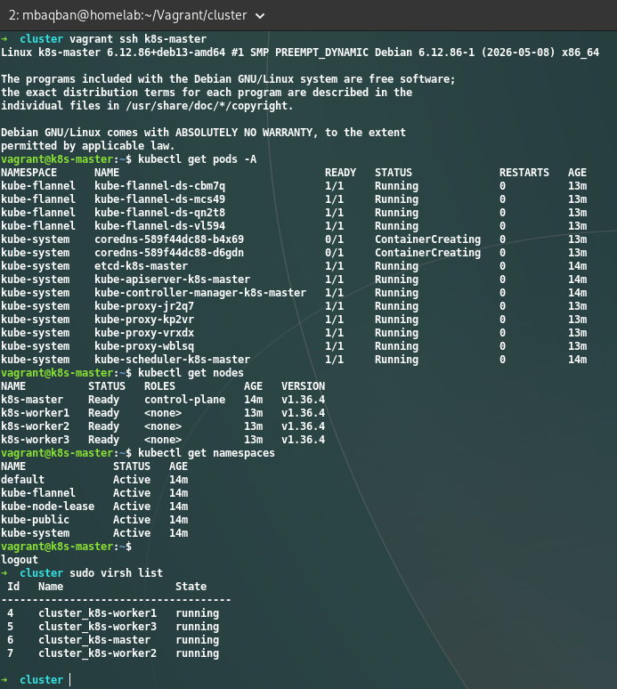

# Use vagrant


### First install dependencies and vagrant it self.


```bash

sudo apt update
sudo apt install -y qemu-kvm libvirt-daemon-system libvirt-clients bridge-utils virtinst


sudo virt-host-validate
```

#### install vagrant from hashicorp
```log
wget -O- https://apt.releases.hashicorp.com/gpg | \
  gpg --dearmor | sudo tee /usr/share/keyrings/hashicorp-archive-keyring.gpg

echo "deb [signed-by=/usr/share/keyrings/hashicorp-archive-keyring.gpg] \
  https://apt.releases.hashicorp.com $(lsb_release -cs) main" | \
  sudo tee /etc/apt/sources.list.d/hashicorp.list

sudo apt update
sudo apt install -y vagrant


vagrant --version
```

# install kvm vagrant plugins

```bash
-> sudo apt install -y ruby-libvirt build-essential libxml2-dev libxslt1-dev zlib1g-dev

-> vagrant plugin install vagrant-libvirt

-> vagrant plugin list                                                                 

vagrant-libvirt (0.12.2, global)
```


### If you wanna test it.

```bash
mkdir test-vm && cd test-vm
vagrant init debian/trixie64
vagrant up --provider=libvirt
```


### Make a custom BOX in vagrant

```
to avoid download and install kubeadm and its dependencies
we will make the custom box that have all of them installed and ready to use.
```


### Run base image

```bash

mkdir base && cd base
nano vagrantfile 
```
copy or write yourself this [dir/base/vagrantfile](https://github.com/Mbaqban/devops-homelab/blob/main/step-03-Iac/vagrant/base/vagrantfile)
you can do it better than me :)

### save box to system vagran box list
vagrant box add debian/trixie64

vagrant ssh default
```

- using [v1.36 Docs](https://v1-36.docs.kubernetes.io/docs/setup/production-environment/tools/kubeadm/install-kubeadm/)


### turn off swapp 

we should turn off the swaap base on [Docs](https://v1-36.docs.kubernetes.io/docs/setup/production-environment/tools/kubeadm/install-kubeadm/#swap-configuration)

```bash
sudo swapoff -a
sudo sed -i '/ swap / s/^/#/' /etc/fstab

free -h

               total        used        free      shared  
Swap:             0B          0B          0B
```

### Kernel modules & network settings

- to be sure that the setting will apply in boot we put them in files.

```bash
cat <<EOF | sudo tee /etc/modules-load.d/k8s.conf
overlay
br_netfilter
EOF

sudo modprobe overlay
sudo modprobe br_netfilter

cat <<EOF | sudo tee /etc/sysctl.d/k8s.conf
net.bridge.bridge-nf-call-iptables  = 1
net.bridge.bridge-nf-call-ip6tables = 1
net.ipv4.ip_forward                 = 1
EOF

sudo sysctl --system

* Applying /usr/lib/sysctl.d/10-coredump-debian.conf ...
* Applying /usr/lib/sysctl.d/50-default.conf ...
* Applying /usr/lib/sysctl.d/50-pid-max.conf ...
* Applying /etc/sysctl.d/k8s.conf ...
kernel.core_pattern = core
kernel.sysrq = 0x01b6
kernel.core_uses_pid = 1
net.ipv4.conf.default.rp_filter = 2
net.ipv4.conf.eth0.rp_filter = 2
net.ipv4.conf.lo.rp_filter = 2
net.ipv4.conf.default.accept_source_route = 0
net.ipv4.conf.eth0.accept_source_route = 0
net.ipv4.conf.lo.accept_source_route = 0
net.ipv4.conf.default.promote_secondaries = 1
net.ipv4.conf.eth0.promote_secondaries = 1
net.ipv4.conf.lo.promote_secondaries = 1
net.ipv4.ping_group_range = 0 2147483647
net.core.default_qdisc = fq_codel
fs.protected_hardlinks = 1
fs.protected_symlinks = 1
fs.protected_regular = 2
fs.protected_fifos = 1
vm.max_map_count = 1048576
kernel.pid_max = 4194304
net.bridge.bridge-nf-call-iptables = 1
net.bridge.bridge-nf-call-ip6tables = 1
net.ipv4.ip_forward = 1
```


### Install containerd

```bash 
sudo apt-get update
sudo apt-get install -y containerd
sudo mkdir -p /etc/containerd
containerd config default | sudo tee /etc/containerd/config.toml
```

### Change cgroup driver 

```
By setting SystemdCgroup = true in containerd’s config, we make containerd use the same cgroup driver (systemd) as kubelet and the OS itself — keeping everything consistent and avoiding those conflicts.

nano /etc/containerd/config.toml
SystemdCgroup = true


sudo systemctl restart containerd
sudo systemctl enable containerd

```


### Add Kubernetes repo

```bash
sudo apt-get update
sudo apt-get install -y apt-transport-https ca-certificates curl gnupg

sudo mkdir -p /etc/apt/keyrings

curl -fsSL https://pkgs.k8s.io/core:/stable:/v1.36/deb/Release.key | sudo gpg --dearmor -o /etc/apt/keyrings/kubernetes-apt-keyring.gpg

echo 'deb [signed-by=/etc/apt/keyrings/kubernetes-apt-keyring.gpg] https://pkgs.k8s.io/core:/stable:/v1.36/deb/ /' | sudo tee /etc/apt/sources.list.d/kubernetes.list


sudo apt-get update
sudo apt-get install -y kubelet kubeadm kubectl
sudo apt-mark hold kubelet kubeadm kubectl
sudo systemctl enable --now kubelet

# verfiy 

kubeadm version
kubectl version --client
```


### end of installing

- Till now we have installed any thing we want 

### Clean up phase

```bash 

# Reset machine-id so each clone gets a unique one (otherwise DHCP/DNS and some cluster components can get confused):

truncate -s 0 /etc/machine-id
rm /var/lib/dbus/machine-id
ln -s /etc/machine-id /var/lib/dbus/machine-id

# Clear any cached kubeadm state (just in case you tested anything):

kubeadm reset -f
rm -rf /etc/kubernetes /var/lib/etcd
```


### Make custom BOX

```bash

sudo apt-get update
sudo apt-get install -y libguestfs-tools
sudo chmod +r /boot/vmlinuz-*

vagrant halt

vagrant package --output k8s-base.box

vagrant box add k8s-base k8s-base.box --provider libvirt
vagrant box list
```

### Use the vagrantfile in this repo
```bash
nano vagrantfile 
```
copy or write yourself this [dir/base/vagrantfile](https://github.com/Mbaqban/devops-homelab/blob/main/step-03-Iac/vagrant/cluster/vagrantfile)
you can do it better than me :)


